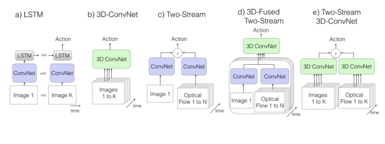
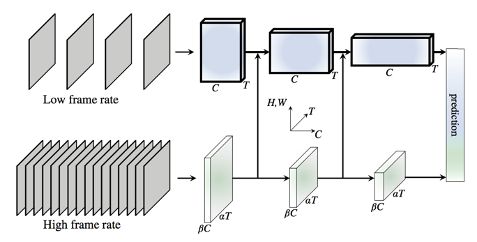
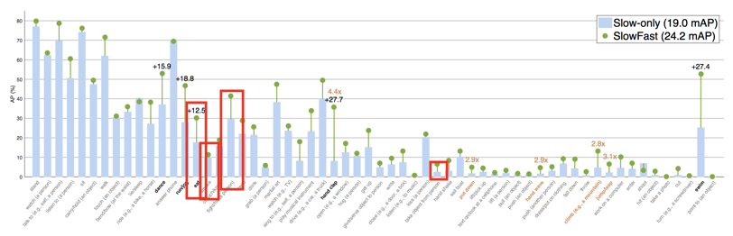
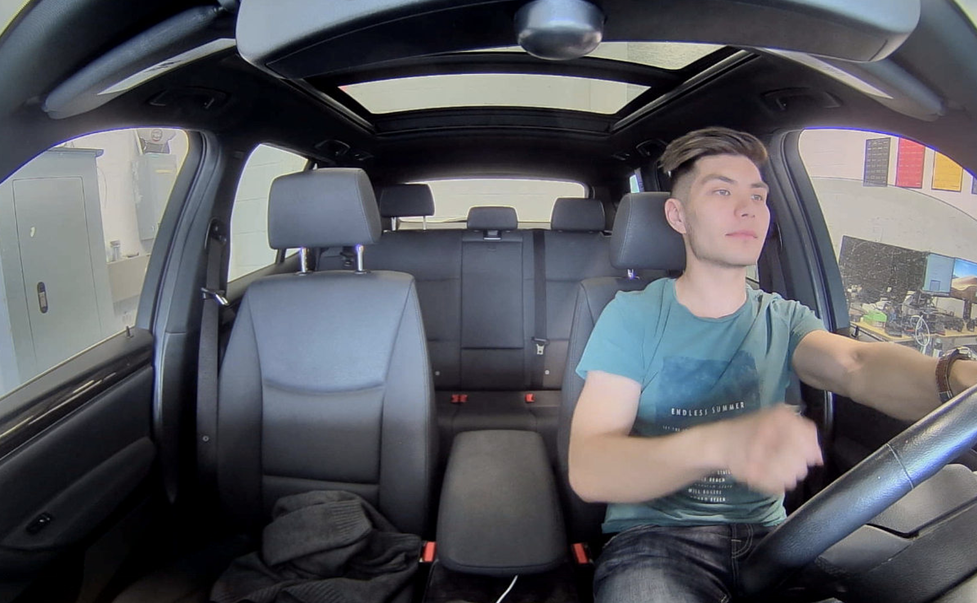
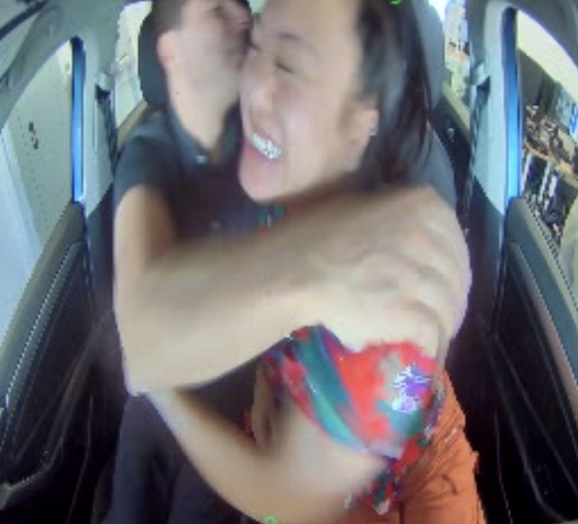
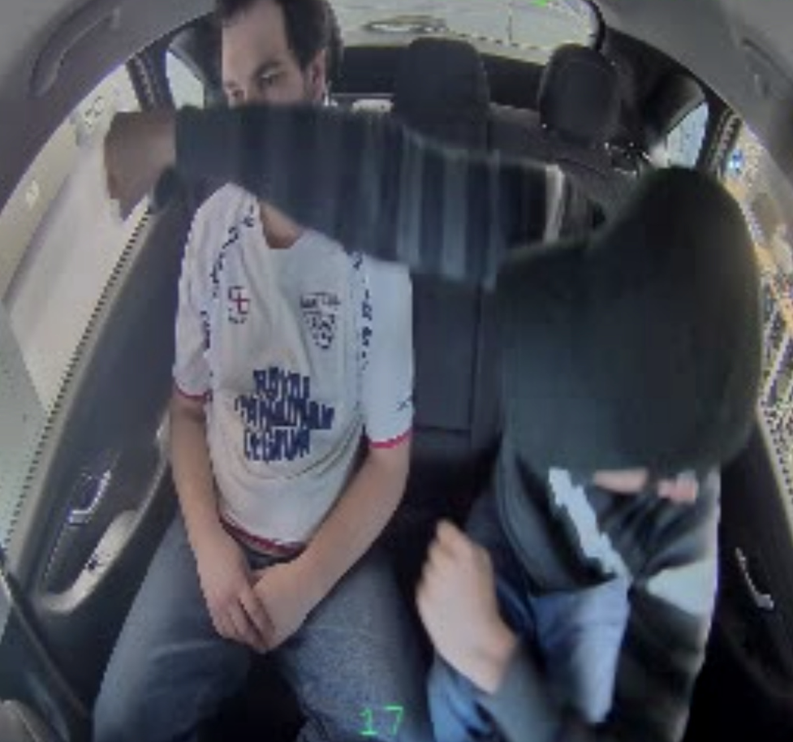
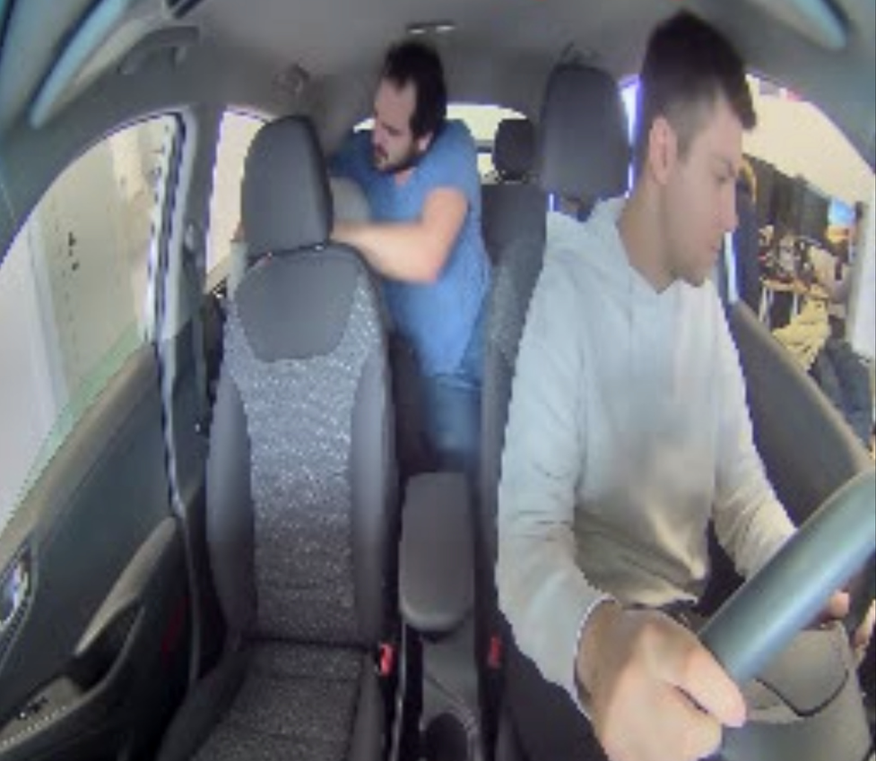
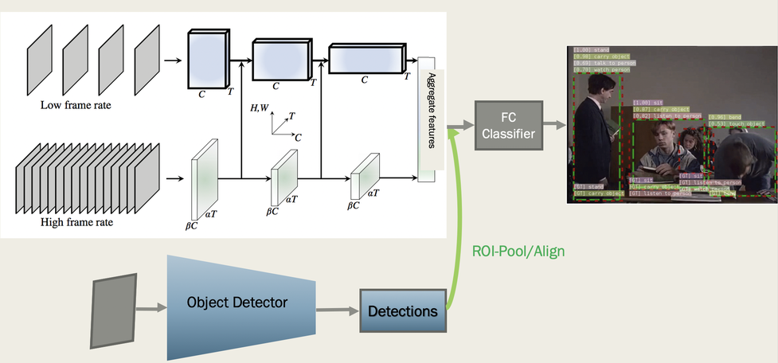

Activity Recognition at PAI
---------------------------

Passengers in any row of the vehicle perform various activities which may involve objects or other passengers.

Some of the activities that we are interested in (non-exhaustive list):

*   Fighting

*   Drinking

*   Eating

*   Enter/Exit

*   Seatbelt on/off


Our goal is to issue a ticket if there is a malicious event present in the cabin. Requirements on exact time localization, i.e. exact timing of beginning and end of the event, are relaxed since agents are able to determine time localization upon receiving a request. Nevertheless, high levels of recall and precision are desirable, with recall being the priority.

Due to the difficulty of the task and extreme imbalance of classes in true data distribution we mainly focus on methods that achieve highest accuracy with a possibility of deploying it into either on cloud or on device.

Overview of methods for Activity Recognition
--------------------------------------------

There is a variety of methods to perform activity recognition. Most of the current state-of-art-methods employ deep learning as its main constituent.



Figure 1. Most common deep-learning-based approaches for activity recognition. \[1\]

LSTM-based approaches usually use a single-frame CNN as a backbone and aggregate temporal information in LSTM cells. This method was very common in the literature but was shown to be inferior to 3D convolutional based approaches like inflated 3D convolutions \[1\] and R(2+1)d convolutions \[4\].

Lots or research focused on RGB and optical flow in which optical flow would model temporal movement of objects while RGB features provide visual information. Generally these methods utilize either classical optical flow method (like Farneback in opencv) or DL-based which uses Flownet \[3\]. SlowFast \[2\] showed that optical flow is not necessary for accurate activity recognition as they achieved state-of-the-art results on raw RGB images. It simplifies our pipeline significantly as we do not need to compute optical flow.

Additional alternative approach is Dynamic Imagenet \[5\] which computes a _dynamic image_ using a classical ML technique and apply 2D convolutional image classification on it. This approach is fast as dynamic image construction executes on CPU and CNN is only 2D instead of 3D. Alternatively, one could first compute pose estimation of people in the scene, obtained 2D keypoints could be feature engineered and sent to LSTM which would perform activity classification on a stream of person features. This method is fast and accurate on tasks that have a lot of pose and movement information and not necessarily visual features.

SlowFast Overview
-----------------

SlowFast codebase: [https://github.com/facebookresearch/SlowFast](https://github.com/facebookresearch/SlowFast)
SlowFast paper: [https://arxiv.org/abs/1812.03982](https://arxiv.org/abs/1812.03982)

SlowFast performs multi-class classification on a window of a series of frames. Therefore each window is independent prediction of the other.



Figure 2. Architecture of SlowFast network.

It has 2 parallel pathways which are very similar. Slow pathway operate on lower FPS (2 FPS) input, while Fast pathway operates on fast fps (16 fps). In order to lower computation overhead, the Fast pathway is 8 times thinner in the number of filters than Slow pathway. Additionally, in order for communication to flow between two pathways there are two temporal connections that aggregate information into heavier Slow pathway from the Fast pathway. At the end of the network, the features are aggregated, computed with FC layer with softmax.

SlowFast offers several easy options for accuracy-latency tradeoff optimization:

*   Backbone change

*   FPS of each of pathways

*   Slow-only pathway without Fast pathway


Thus we have experimented with 2 configurations: Slow-Only with Resnet-50 backbone and SlowFast with Resnet-101 backbone.



Figure 3. Average Precisions of SlowFast for classes in AVA Dataset \[6\] ordered (descending) by the number of examples.

Figure 3 shows precisions of SlowFast on each class in AVA dataset. We can clearly see that easier actions like sit and run have significantly higher average precisions while more difficult atomic actions like take object from another person are extremely difficult. Additionally, we note that the number of examples significantly influences the accuracy of the model, as you can see the accuracies drop as you move to the right of the graph which corresponds to less number of examples.

Dataset Collection and Overview
-------------------------------

Our dataset consists of various actions in sedan-like vehicles. We focused on detecting fighting and drinking, thus classifying between 3 classes: _background, fighting and drinking_. Nevertheless, background class contains many various actions which are not fighting&drinking so that the model has an exposure to full data distribution and generalizes at test time. These include but are not limited to: enter&exit, seatbelts on&off, talking, hugging, handshakes, switching seats.

Additionally difficult “false-positive” type examples are collected which should closely resemble a given action as if the agent is trying to fool the system. An example of this is fighting-like action of one person throwing fists in front of the other person without any real fighting taking place.


For drinking class it’s making a drinking-like motion without a beverage and moving a drink around the cabin without actually drinking.



| **Background** | **Fighting** | **Drinking** |
| --- | --- | --- |
| 3754 | 1364 | 285 |

Table 1. Number of examples per class. We consider an example as an action sequence which is at most 15 second long. If the action sequence is longer than 15 seconds we split it.

Annotation is done with an accuracy of 0.5 second. Clips which are less than 2 second long are discarded. Every example has only one class.

Computational Results
---------------------

Training System Details: Pytorch 1.3, CUDA 10.0, Nvidia 2080 Ti
Edge System Details: Pytorch 1.2, Jetpack 4.2.3, Jetson Xavier

Pytorch on Jetson Xavier on 2-second window of 256x256 images:

*   Slow-Only at 2fps with Resnet-50 backbone on 4-frame sequence: 41 ms per second

*   SlowFast at 16fps with Resnet-101 backbone on 32-frame sequence: 180 ms per second


Quantitative Accuracy Results
-----------------------------

We use F1 score as our official metric of the model’s accuracy. It takes into account class imbalance present in the dataset. Additionally we compute _weighted_ F1 score which is weighted by the number of examples in order to take into account number of examples per class.

Due to the fact that we performed very limited hyperparameter optimization, in fact only learning rate schedule, validation set is in principle as similar to an independent test set.

Train Weighted F1: 0.98
Val Weighted F1: 0.95

Per-class metrics:

| **Val Background F1** | **Val Fighting F1** | **Val Drinking F1** |
| --- | --- | --- |
| 0.97 | 0.88 | 0.90 |

Qualitative Accuracy Results
----------------------------

Qualitative results on videos fully support obtained high quantitative results. In most examples and in most situations the model predicted correct class.

Generally failure cases comprised a specific set of actions. However even in these difficult situations the model didn’t consistently fail, it only failed at times. The model had lower accuracy with the following actions:

*   Hugging or any other fast full-body or hand motions





*   “Negative Fighting”




*   Failures due to occlusion



These failure cases (apart from occlusion) can be improved with the provision of more data. Our experiments which happened during the data collection and annotation phase confirmed that the model is capable of learning difficult cases as long as the data is available in sufficient quantity.

Installation
------------

```
cd passengerai/slowfast
python setup.py build develop
```
See INSTALL.md for additional details.

Project Workflow
----------------

1.  Download pre-trained weights of SlowFast trained on AVA dataset.
    Model weights are available here: [https://github.com/facebookresearch/SlowFast/blob/master/MODEL\_ZOO.md](https://github.com/facebookresearch/SlowFast/blob/master/MODEL_ZOO.md) .
    The two models trained on AVA that we used are: SlowOnly\_R50\_4x16 and SlowFast\_R101\_8x8.

2.  Prepare the dataset.
    See the folder of dataset for mode information about the dataset and how to preprocess it.
    The dataset consists of 2 elements: folder of video clips and csv file with video path and its class.

3.  Modify necessary fields in the config file.
    Specifically, the paths to the dataset has to be modified. The two configs that were used are: Slow-Only: C2D\_8x8\_R50\_PAI\_scene.yaml and SlowFast: SLOWFAST\_32x2\_R101\_50\_50\_PAI\_scene.yaml.

4.  Train.
    Run `python tools/run_net.py --cfg configs/AVA/your_config_file`.
    Quantitative results and logs on train and validation sets will be generated in mlflow automatically.

5.  Validate results on videos.
    `python tools/run_on_video.py --cfg configs/AVA/your_config_file -c checkpoints/your_chosen_checkpoint.pyth -d /path/to/folder/of/videos -o /path/to/output/folder`


Person-level Activity Recognition
---------------------------------



In order to enable a person-level activity recognition one would need to employ a separate object detector. As shown in the figure above, detections fed from object detector would be used to “select” features from SlowFast using ROIAlign layer. For every object detector there will be 3D feature tensor, and for each feature set a prediction will be made by a FC classifier. Assuming that ground-truth object detections are available at training time, the network training is end-to-end.

Discussion and Future Work
--------------------------

Some improvements can be made with respect to latency and accuracy.

Latency improvements:

*   Backbone change (e.g. EfficientNet)

*   Distillation

*   TensorRT or TVM.
    Specifically TensorRT 7 should have stable support for 3D convolutions. TensorRT 7 is available in Jetpack 4.4.


Accuracy improvements:

*   More data

*   Audio-visual input [https://arxiv.org/abs/2001.08740](https://arxiv.org/abs/2001.08740)

*   Better backbone (e.g. EfficientNet)


References
----------

\[1\] Carreira J. & Zisserman A. “Quo Vadis, Action Recognition? A New Model and the Kinetics Dataset”. Proceedings of the IEEE Conference on Computer Vision and Pattern Recognition. 2017.

\[2\] Feichtenhofer C. et al. SlowFast Networks for Video Recognition. Proceedings of the International Conference on Computer Vision. 2019.

\[3\] Ilg E. et al. FlowNet 2.0: Evolution of Optical Flow Estimation with Deep Networks. Proceedings of the IEEE Conference on Computer Vision and Pattern Recognition. 2017.

\[4\] Tran D. et al. A Closer Look at Spatiotemporal Convolutions for Action Recognition. Proceedings of the IEEE Conference on Computer Vision and Pattern Recognition. 2018.

\[5\] Bilen H. et al. Action Recognition with Dynamic Image Networks. IEEE Transactions on Pattern Analysis and Machine Intelligence (TPAMI). 2017.

\[6\] Gu C. et al. AVA: A Video Dataset of Spatio-temporally Localized Atomic Visual Actions. IEEE Conference on Computer Vision and Pattern Recognition. 2018.
