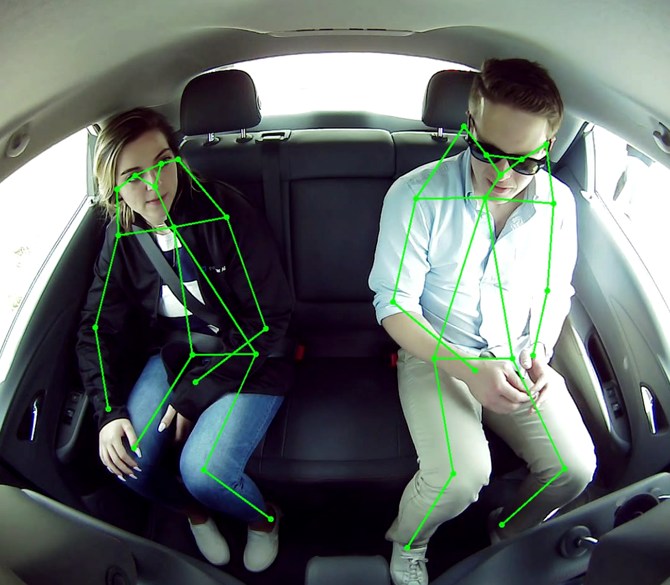
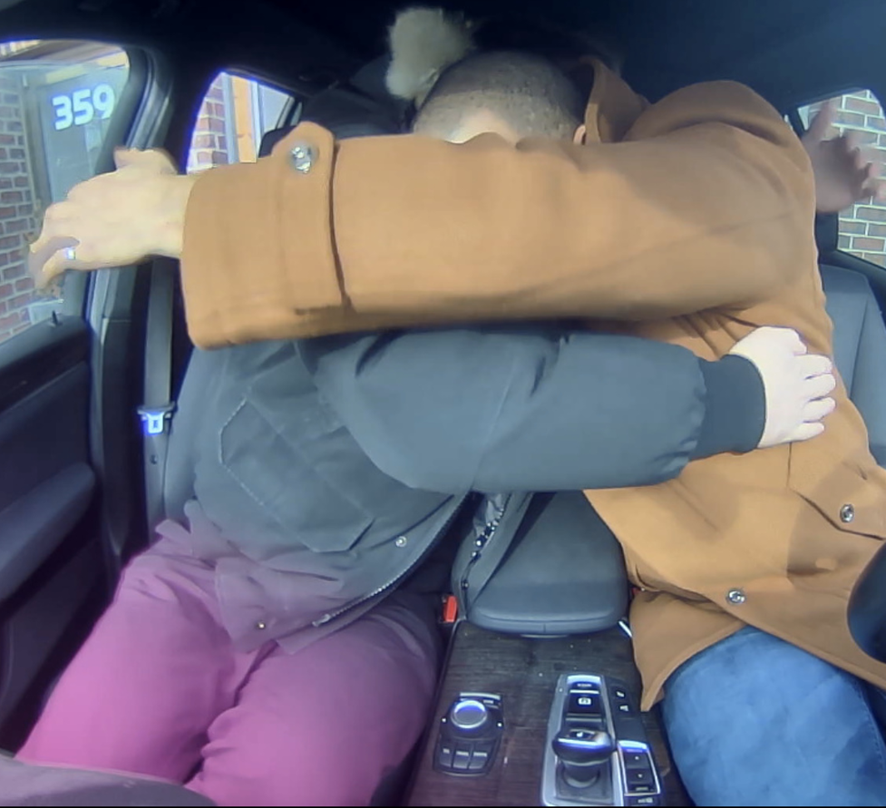
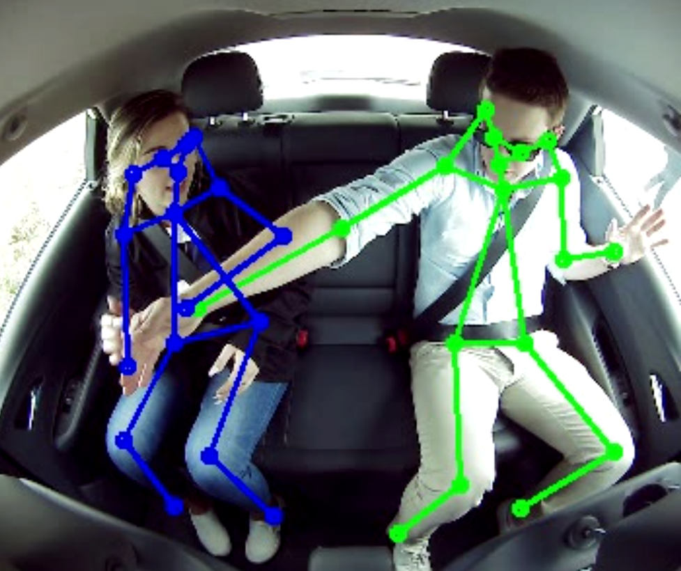
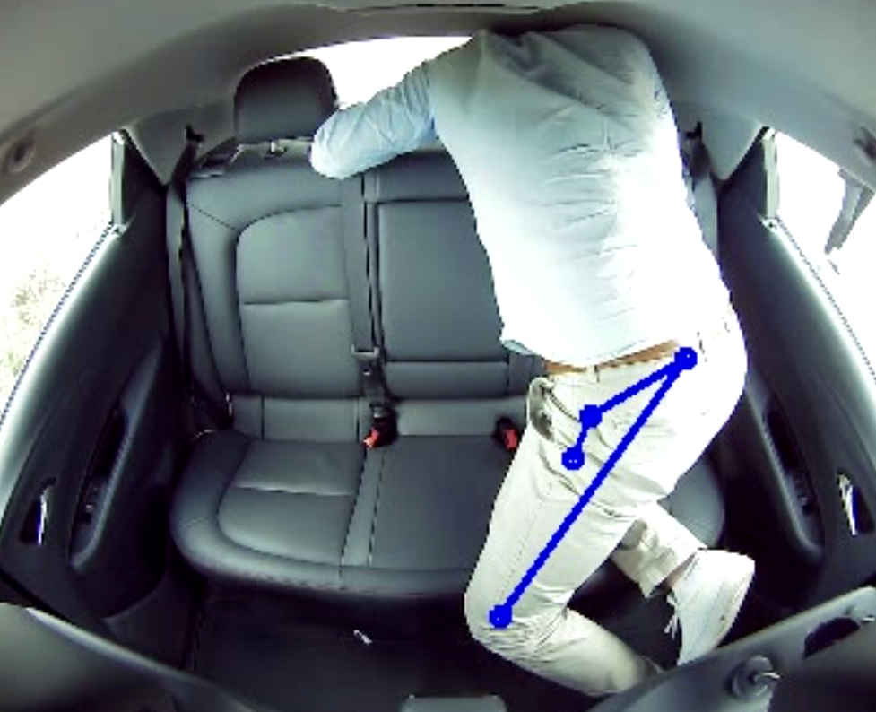
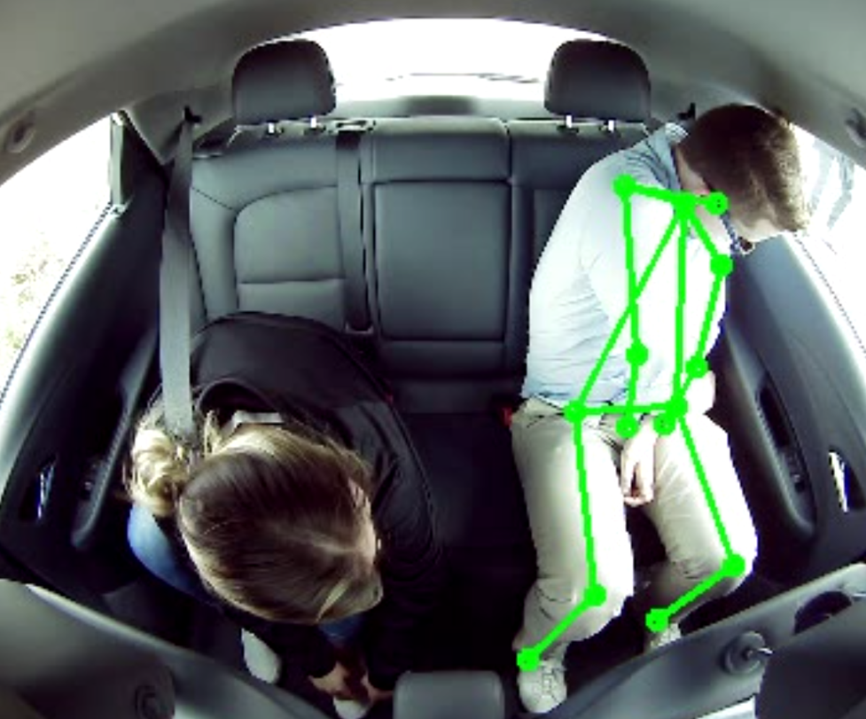
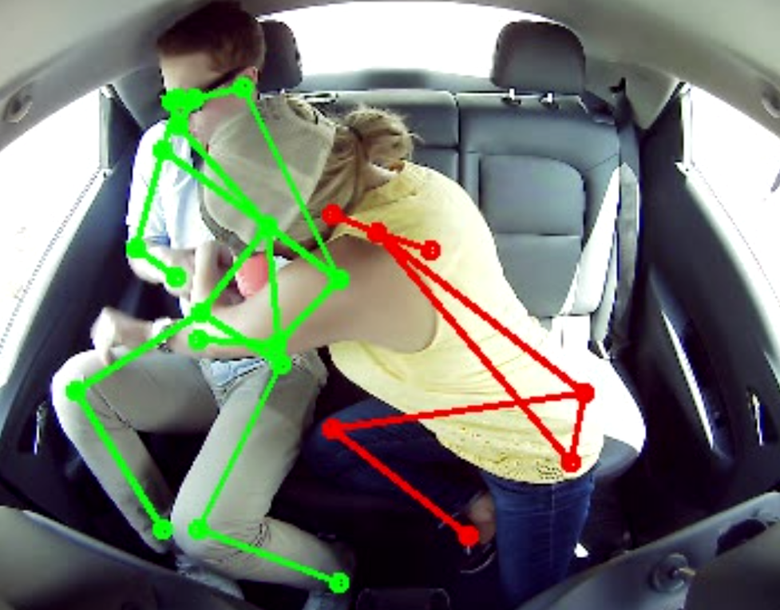

Introduction to 2D pose estimation
----------------------------------

The task of 2D pose estimation is to predict 2D keypoints of the objects in question in the image plane. For person pose estimation most datasets focus on 17-19 body keypoints such as eyes, shoulders, hips, wrists and etc…



There are 2 main approaches: _top-down and bottom-up_.
Top-down approaches first compute object detections and then apply single-person pose estimation on each object detection. This method avoids performing keypoint-to-object matching problem which is difficult to solve with deep learning.
Bottom-up approaches use a single network to perform multi-person pose estimation. One of the main works in this family of methods is based on CMU-Pose \[1\]. A neural network predicts two types of outputs: keypoint heatmap and 2 Part Affinity Fields (PAFs) for each joint. PAFs are vectors in image plane that start from one joint and end at another joint in the skeleton, e.g. wrist to elbow. After the network’s forward pass, there is a decoding step which is responsible for extracting keypoints from heatmaps and using keypoints and PAFs to perform keypoint-to-object matching.

Pose Estimation at PAI
----------------------

There are several applications where output of pose estimation is used in PAI product:

*   Feet on seats detector: detects whether people have any of the feet on seats by comparing ankle keypoints with a predefined vertical threshold of the given cabin.

*   Hand on leg detector: detects whether person’s A hand touches person’s B leg by looking how close anyone’s wrist keypoint is to other people’s leg keypoints.

*   Sitting unsafely detector: detects whether a person is not sitting safely (lying down, sliding through the cabin, etc…) in abnormal positions by using an SVM on features computed from keypoints. Features are inter-keypoint x, y, l1 distances.

*   Human object tracking improvement: we fuse pose with object detections for tracking. In some cases object detection might fail to detect passengers; therefore it is beneficial to use information from keypoints. Specifically, we use a union of keypoints as a supplemental object for object tracking whenever an object detection is not available.


We decided to use bottom-up approach due to the following reasons:

*   Cases of humans overlap. There are lots of cases when humans' object detections and poses overlap. In these cases top-down’s object single-object pose estimation will produce sub-optimal results as its input would include another human’s joints too. See the image below for an example of overlapping poses in a single object detection. Moreover, object detection might completely fail which would produce no pose.




*   Top-down approach is a function of number of objects which would provide intermittent latencies on device as the number of people in the scene varies.

*   Objects are very large and close to the camera. Thus having two-three people in the sedan cabin would have similar computational overhead as running a network on full image.

*   Moreover, it opens a possibility to perform object detection and pose estimation with shared backbone.


Project Overview: TRT-Pose
--------------------------

Link to project: [https://github.com/NVIDIA-AI-IOT/trt\_pose](https://github.com/NVIDIA-AI-IOT/trt_pose)

TRT-Pose project is a combination of two papers: 1) original CMU-Pose \[1\] from which the general method of multi-person pose estimation and specifically offline decoding is taken from, and 2) Simple Resnet Baseline paper \[2\] from which the backbone architecture and training details are taken from.

Most of the project is implemented in Pytorch 1.x, offline decoding is implemented in C++ and called as a Python extension using PyBind. It uses a package `torch2trt` which provides seamless conversion between pytorch model to TensorRT engine binary.

There are a variety of backbones available as they are taken from torchvision library and slightly modified. We experimented with Resnet and Densenet with various number of layers. Densenet generally shows very high latency overhead in comparison to Resnet without providing any substantial accuracy improvement, therefore we use Resnet backbone. Specifically Resnet-50 was of acceptable accuracy and latency of batch\_size=3 on Jetson Xavier.

Dataset Collection and Overview
-------------------------------

We have manually extracted image frames from videos which have actors in vehicles performing various activities. Dataset contains more challenging poses like fighting and overlapping poses which we found are difficult to predict reliably. It also contains both front and back seat camera views. We label 18 keypoints. Note that in original COCO keypoints dataset the neck keypoint is not labeled, we label it explicitly.

Our custom dataset consists of 9100 images of several dozen actors performing various poses.

Benchmark on Jetson Xavier
--------------------------

Trained and tested with: CUDA 10.0, torch 1.3, torchvision 0.4.2, torch2trt 0.3.0, on Ubuntu 18.04 and Nvidia 2080 Ti. Runtime with Jetson Xavier and Jetpack 4.2.3 (TensorRT 5.1).

Benchmark of Resnet-50 on Jetson Xavier with Jetpack 4.2.3 on tensor of shape \[3, 3, 352, 352\] with fp16 precision:

|     |     |
| --- | --- |
| **Pre-processing Time**  <br>Includes image normalization, image concatenation into a batch | 21 ms |
| **Forward Pass Time**  <br>Inference of a neural network on the GPU, outputs a batch tensor of heatmaps and PAFs | 29 ms |
| **Post-processing Time**  <br>Full decoding of heatmaps and PAFs which produce 2D keypoint coordinates of all humans in the scene. | 8 ms |
| **Total Time** | 58 ms |

*   Memory footprint was less than 500 MB.

*   Pre-processing is a function of batch size and image size.

*   Post-processing is a function of number of objects.

*   352x352 image size is divisible by 32 which is optimal number for TensorRT, and most importantly it provided a good latency and accuracy.


Unfortunately, int8 conversion of the whole network wasn’t successful last time I tried. However, interestingly using `torch2trt` and converting torchvision’s Resnet-50 backbone on its own worked with int8.

Accuracy Results:
-----------------

We evaluate our model on a variety of videos that span different lighting conditions, cars, cabins, backgrounds, camera angles, actors and their clothing. In general this model has a good accuracy, it generalizes to new cabins, lighting conditions, people, poses.

Nevertheless, there are several specific cases of failure:

1.  Crossing limbs of two people. If the same limb type of two different people is crossed, then the network is most likely to match the keypoints to object wrong. This is a fundamental limitation of the method of multi-person pose estimation. In the picture below, woman’s wrist keypoint is matched to man’s keypoint as PAF of each person’s wrist-elbow cross.




2.  Difficult poses. These can be various very difficult poses: e.g. think of difficult yoga poses. These cases would substantially improve with addition of more data.




3.  Leaning forward, switching seats. In these two cases there are very limited amount of features available as the face and hands (which are most crucial features) are not visible.




4.  Fast Motion, Fighting. Poses deteriorate because of combination of 1) overlapping bodies and 2) motion blur.




Installation
------------

```
cd passengerai/trt-pose
pip install -r requirements.txt
conda install pytorch torchvision cudatoolkit -c pytorch
git clone https://github.com/PassengerAI/trt-pose
cd trt-pose
sudo python3 setup.py develop
```

Project Workflow
----------------

1.  Pre-train the network on COCO dataset.
    This provides us with generalizability as our dataset size is limited and COCO consists of 120k images.
    It would involve downloading [COCO 2017 keypoint dataset](http://cocodataset.org/#download) and changing the path fields to the dataset in the config `resnet50_att_352x352_COCO.json`.
    Run `python -m trt_pose.train ./tasks/human_pose/resnet50_att_352x352_COCO.json` to start training.

2.  Fine-tune the network on our own dataset starting with lower learning rate.
    Change the `initial_state_dict` field in the `resnet50_att_352x352_PAI.json` in order to start finetuning from the weights of pretrained model. As the whole network is already pre-trained, we would start with “smoother” lower learning rate which is in the config.
    If you are using PAI’s dataset then you would need to convert the format of keypoints using a `convert_keypoint_format.py` script.
    Run `python -m trt_pose.train ./tasks/human_pose/resnet50_att_352x352_PAI.json` to start training.

3.  Convert to TensorRT binary on target device.
    TensorRT provides large improvement in inference latency and memory overhead on Nvidia hardware. Thanks for `torch2trt` package, which seamlessly converts between pytorch model to TensorRT, it’s very simple.
    Running `tasks/human_pose/convert_trt_profile.py` would generate a TensorRT binary file and give profiling latency benchmarks on its performance on the video.

4.  Make sure it has expected latency and there wasn’t decrease in accuracy. Review the outputs and results of `convert_trt_profile.py` on multiple videos.

5.  Perform inference using the TensorRT binary.
    Follow the code in the `inference-engine` in passengerai repo: `/passengerai/inference-engine/inference_engine/server/engines/pose_estimation/PoseEstimationEngine.py`
    Inference-engine has trt-pose as dependency which is installed using pre-compiled wheels. One can compile the wheels from `trt_pose` repo on device using this command: `python setup.py bdist_wheel`.


NOTE: training curves of previous experiments are available in MLFlow logs (which are contained in `mlruns` folder). Start MLFlow browser gui with `mlflow ui`.

References:
-----------

\[1\] Cao, Zhe, et al. "Realtime multi-person 2d pose estimation using part affinity fields." Proceedings of the IEEE Conference on Computer Vision and Pattern Recognition. 2017.

\[2\] Xiao, Bin, Haiping Wu, and Yichen Wei. "Simple baselines for human pose estimation and tracking." Proceedings of the European Conference on Computer Vision (ECCV). 2018.
